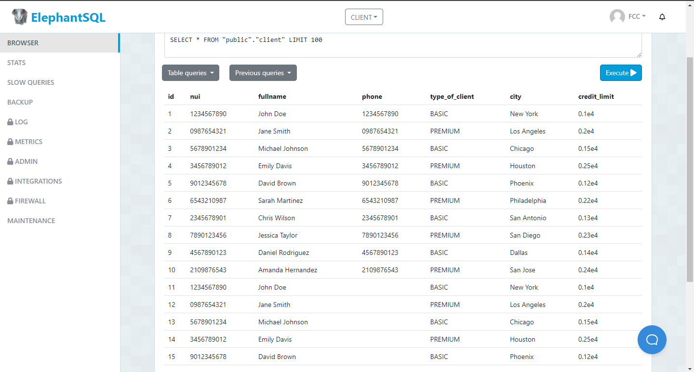

# Tarea en clase semana 8
## La funcion count
### Creacion  de la tabla
El siguiente codigo genera la tabla **'client'**
```
CREATE TABLE IF NOT EXISTS client(
id SERIAL,
nui VARCHAR(100) NOT NULL,
fullname VARCHAR(100) NOT NULL,
phone VARCHAR(10),
type_of_client VARCHAR(50) DEFAULT 'BASIC',
city VARCHAR(50),
credit_limit DECIMAL(7,2)
);
```
### Inserccion de datos

```
INSERT INTO client (nui, fullname, phone, type_of_client, city, credit_limit) 
VALUES 
('1234567890', 'John Doe', '1234567890', 'BASIC', 'New York', 1000.00),
('0987654321', 'Jane Smith', '0987654321', 'PREMIUM', 'Los Angeles', 2000.00),
('5678901234', 'Michael Johnson', '5678901234', 'BASIC', 'Chicago', 1500.00),
('3456789012', 'Emily Davis', '3456789012', 'PREMIUM', 'Houston', 2500.00),
('9012345678', 'David Brown', '9012345678', 'BASIC', 'Phoenix', 1200.00),
('6543210987', 'Sarah Martinez', '6543210987', 'PREMIUM', 'Philadelphia', 2200.00),
('2345678901', 'Chris Wilson', '2345678901', 'BASIC', 'San Antonio', 1300.00),
('7890123456', 'Jessica Taylor', '7890123456', 'PREMIUM', 'San Diego', 2300.00),
('4567890123', 'Daniel Rodriguez', '4567890123', 'BASIC', 'Dallas', 1400.00),
('2109876543', 'Amanda Hernandez', '2109876543', 'PREMIUM', 'San Jose', 2400.00);
```

### Inserccion de datos

```
INSERT INTO client (nui, fullname, phone, type_of_client, city, credit_limit) 
VALUES 
('1234567890', 'John Doe', NULL, 'BASIC', 'New York', 1000.00),
('0987654321', 'Jane Smith', NULL, 'PREMIUM', 'Los Angeles', 2000.00),
('5678901234', 'Michael Johnson', NULL, 'BASIC', 'Chicago', 1500.00),
('3456789012', 'Emily Davis', NULL, 'PREMIUM', 'Houston', 2500.00),
('9012345678', 'David Brown', NULL, 'BASIC', 'Phoenix', 1200.00);
```


### Consulta de datos
### Count
```
SELECT COUNT (fullname) AS total_names
FROM CLIENT
```

### Mostrar el total de nombres
Para mostrar todos los nombres usamos la funcion **COUNT ()** pasandole como parametro el campo, en este caso *-fullname-*
